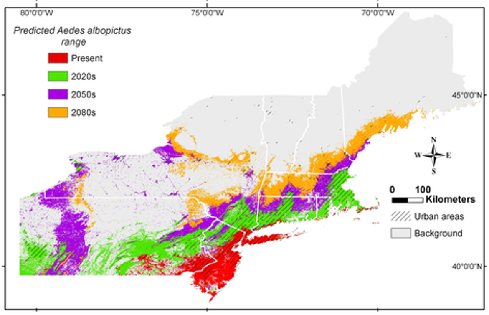

```{r setup, include=FALSE}
knitr::opts_chunk$set(echo = TRUE)
```

## Mosquitos as Vectors 

Vector-borne diseases account for 17% of all infestious diseases worldwide (www.who.int), and over one million people die from mosquito-borne diseases every year. Mosquitoes are also vectors for diseases that afflict farm animals, pets and native animals. Most mosquito species have a preference for either humans or certain animals as the source of their blood meal. They are attracted by body odors, carbon dioxide, and heat emitted by person or animal. Diseases transmitted by mosquitoes in the United States include dog heartworm, West Nile virus, equine encephalitis, malaria, dengue and yellow fever. 

## NEON animal and pathogen monitoring

The National Ecology Observation Network (NEON) maintains long-term ecological monitoring sites strategically placed throughout the United States. Each monitoring site collects an impressive suite of ecological data to build our understanding of how terrestrial and aquatic ecosystems function. Data colletion encompasses all aspects of ecosystem processes, including monitoring of the atmosphere, living communites, nutrient cycling, hydrology and land cover. All data collected across NEON sites is publically available and allows for comparisons across regional and continental scales (https://data.neonscience.org/home). 

## Mosquitoes as disease vectors in the USA

1) The most prominent mosquito-borne diseases are transmitted by three genera of mosquitoes – Aedes, Culex, and Anopheles. Perform web searches for these genera of mosquitoes in the United States. Identify and report target mosquito specues that are currently of high concern for disease transmission on the East Coast of the United States. 

<!-- Two species, *Aedes aegypti* (yellow fever) and *Aedes albopictus* (southern house mosquito), carry several of these dangerous diseases but currently have a limited range in the United States. These two species tend to be mostly  found in the South and Southeast, however, the range of *Aedes albopictus* extends into northeast towards New York. Anopheles mosquitoes are best known for spreading malaria, Anopheles quadrimaculatus carries malaria but the disease has been wiped out. Culex pipiens and Culex tarsalis are most likely to carry west nile virus. -->

2) Are the species you have identified mostly classified as Native or Non-Native to the United States? What role do you beleive this plays in rates of disease transmission in this country?

/
/
/
/
/
/


3) In 2017, there were an estimated 219 million cases of malaria in 87 countries. According to the latest World Malaria report^2^, the USA spent ~ 3.1 billion in 2017 for malaria control and elimination. The United States, however, shares a very low burden of Malaria on the global scale. Examine the center for disease control's (CDC) website and summarize the history of the CDC and malaria as a major public health problem in the USA.

/
/
/
/
/
/

## Vector ecology of mosquitoes in eastern USA

This module includes data for mosquito collection, pathogen status and climate variables from three NEON collection sites; Ordway-Swisher Biological Station, Blandy Experimental Farm and Harvard Forest. Using data from the last 24 months at each site, answer the following questions to build an understanding of ecological vector status and risk of transmission along a latitudinal gradient on the east coast of the United States.

/

4) The NEON monitoring site at the Blandy Experimental Farm (University of Virgina) lies only 35 miles away from the Shepherd University campus. Examine the taxonomist list (mosquito_taxonomy.csv), pathogen status (mosquito_pathology.csv) and associated metadata of mosquito species that have been collected at the Blandy site. What s

/
/
/
/
/
/

5) Using the available data, explore the prevalence of mosquitoes at each experimental site. 
a) Does the total diversity of species change with latitude? 

/
/
/


b) Are there patterns in either occurence of disease carrying mosquitoes or prevalence of pathogens with latitude?

/
/
/

6) Using recent monthly climate data for each site (weather_summary.csv), visualize and report patterns in climate variables that may help explain any trends you report in Q5.

/
/
/
/
/
/

7) Perform a web search for the life cycle of mosquitoes. How is the life cycle impacted by climate variables? What role do you believe this plays in the occurence of mosquiotes at the 3 NEON sites?
/
/
/
/
/
/

7) Mosquitoes thrive in a diverse array of habitats?  Examine the current locations of NEON field sites (https://www.neonscience.org/field-sites/field-sites-map). Why might NEON field site location impact the ability to use collection data as indices for disease tranmission? Give an example.

/
/
/
/
/
/

## Will global change affect mosquito prevalence and disease transmission?

Among the many consequences of human-caused climate change is a change in the pattern, incidence and location of some diseases spread by biting mosquitoes. The number of mosquito “disease danger days” is increasing across much of the U.S. as temperatures rise, representing a greater risk for transmission of mosquito-borne diseases (www.https://www.climatecentral.org/). To examine the role temperature plays in disease transmission from mosquitoes, Climate Central analyzed the number of days each year in the spring, summer, and fall with an average temperature between 61 degrees and 93 degrees Fahrenheit. This is the range for transmission of diseases spread by mosquitoes of the *Aedes* or *Culex* type (Figure 1).


Figure x. Typically disease danger days

/
8) Plot the monthly average temperature for each of the three NEON field sites. For each site, calculate a rough estimate of the 'disease danger days' for a calendar year. 

/
/
/
/
/
/

9) A recent study by Rochlin et al. 2013 examined the role of future climate change in range expanision of the Asian Tiger Mosquito (Figure x). Using your findings from all of these previous questions, summarize how shifts in atmospheric carbon dioxide, temperature and precipiation will impact the the prevalence of mosquito-bourne diseases (current and/or new) across the USA. Will there be regions in the USA where mosquito-bourne diseases could decline?


/
/
/
/
/
/
/
/
/
/
/




Figure 2 . Potential range expansion of Asian Tiger mosquito under high future CO^2^ emissions scenario (from Rochlin et al. 2013). 

/

10) Global change encompasses more than just shifts in climate. From what you have learned, do you beleive increasing urbanization will impact the prevalence of mosquito-bourne diseases in the future? 

/
/
/
/
/
/

## Works Cited

Rochlin I, Ninivaggi DV, Hutchinson ML, Farajollahi A (2013) Climate Change and Range Expansion of the Asian Tiger Mosquito (Aedes albopictus) in Northeastern USA: Implications for Public Health Practitioners. PLOS ONE 8(4): e60874.

(https://www.who.int/malaria/publications/world-malaria-report-2018/en/)


## Data description
The data used in this module are from the three terrestrial field sites in NEON’s Domain 02, the Mid Atlantic, and include
BLAN, SCBI, and SERC. For field site descriptions and full names see the NEON field sites webpages
(https://www.neonscience.org/field-sites/field-sites-map). The data are from June 2015 to December 2016.
1

Faculty who want to use a more recent data or data from another location are encouraged to use the NEON data portal (data.neonscience.org) to create a customized data set.


## Goal: Explore any differences between pathogen status and mosquito populations along a latitudinal gradient of NEON field sites on the east coast of the United States

## Goal: Estimate the 'disease danger days' at each field site 


## Learning objectives

Upon completion of the module, students will be able to:


##

