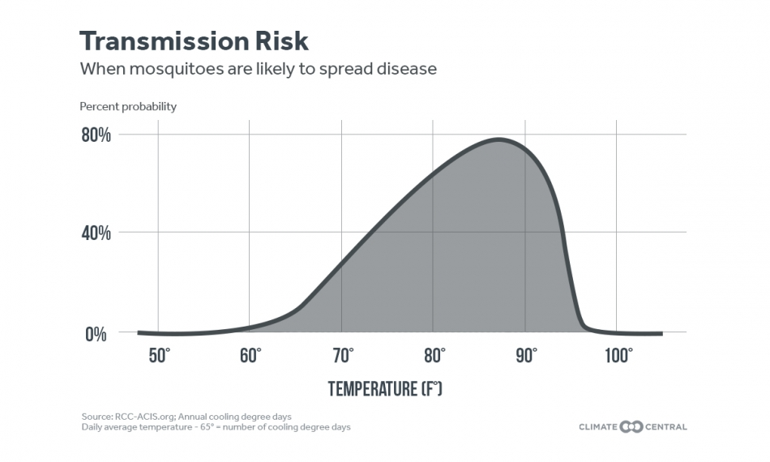

```{r setup, include=FALSE}
knitr::opts_chunk$set(echo = TRUE)
```

## Mosquitos as Vectors 

Vector-borne diseases account for 17% of all infestious diseases worldwide (www.who.int), and over one million people die from mosquito-borne diseases every year. Mosquitoes are also vectors for diseases that afflict farm animals, pets and native animals. Diseases transmitted by mosquitoes in the United States include dog heartworm, West Nile virus, equine encephalitis, malaria, dengue and yellow fever. Two species, Aedes aegypti and Aedes albopictus, carry several dangerous diseases and currently a limited range in the U.S. These two species tend to be mostly be found in the South and Southeast, however, the range of Aedes albopictus extends into northeast towards New York.

/

Among the many consequences of human-caused climate change is a change in the pattern, incidence and location of some diseases spread by biting mosquitoes. 
The number of mosquito “disease danger days” is increasing across much of the U.S. as temperatures rise, representing a greater risk for transmission of mosquito-borne diseases (www.https://www.climatecentral.org/). To examine the role temperature is playing in disease transmission from mosquitoes, Climate Central analyzed the number of days each year in the spring, summer, and fall with an average temperature between 61 degrees and 93 degrees Fahrenheit. This is the range for transmission of diseases spread by mosquitoes of the Aedes or Culex type. 



/

The National Ecology Observation Network (NEON) maintains long-term ecological monitoring sites strategically placed throughout the United States. Each monitoring site collects an impressive suite of ecological data to build our understanding of how terrestrial and aquatic ecosystems function. Data colletion encompasses all aspects of ecosystem processes, including monitoring of the atmosphere, living communites, nutrient cycling, hydrology and land cover. All data collected across NEON sites is publically available and allows for comparisons across regional and continental scales (https://data.neonscience.org/home). 

## Goal: Understand the ecology of mosquite populations near you

NEON maintains a monitoring site at the Blandy Experimental Farm (University of Virgina) only 35 miles away from the Shepherd University campus. 


## Goal: Explore any differences between pathogen status and mosquito populations along a latitudinal gradient of NEON field sites on the east coast of the United States

## Goal: Estimate the 'disease danger days' at each field site 

